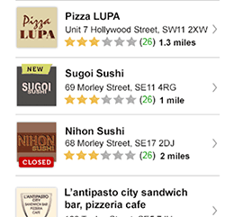

Consumer Web UI Applications Recruitment Test
===========================================

Thank you for taking the time to do our technical test. It consists of two parts:

* Coding test
* A few questions

# Coding Test

We have included an example of the output in <a>data.json</a>, please feel free use this directly rather than referencing our public API.

##Coding Test 1

Build a web page - using whatever tools, frameworks and techniques of your choosing - to achieve as similar a result as possible to the screen grab below. You can find the required JSON data required in the accompaning file <a href="data.json">data.json</a>. 

This Page should:

1. allow users to view and filter restaurants
2. results should display (at least) the following for each restaurant
	* Name
	* Average rating
	* Restaurant logo
	* Cuisine Types
3. allow users to sort results by Name or Average rating (Client Side)

### Task requirements

- All requirements to be completed with an appropriate level of testing.
- Feel free to use whatever javascript, testing, mocking/stubbing frameworks you prefer, along with any other packages.
- Your code should be of production quality.
- Please include a readme file on how to get your application up and running
 
##Coding Test 2

Write a function that will pass the following Jasmine test for a basket total calculator (please feel free to extend the test criteria to ensure it is fit for purpose).

		describe("basket total calculator", function () {
			var basketCalc = new BasketCalculator();
			it("Can add items to the basket total", function () {
				expect(basketCalc.add(2.3)).toEqual(2.3);
				expect(basketCalc.add(1.3)).toEqual(3.6);
				expect(basketCalc.add(5)).toEqual(8.6);
			});
			it("Can remove items from the basket total", function () {
				expect(basketCalc.remove(2)).toEqual(6.6);
				expect(basketCalc.remove(2.6)).toEqual(4);
			});
		});

# Questions

* Did you have time to complete the coding test? What would you add to your solution if you had more time?
* What's your favourite programming language? Why?
* List a few of your prefered Javascript frameworks (also let us know in which situations you would choose to use/not use them)
* Please describe yourself using either XML or JSON.

In order to avoid bounced emails we would like you to submit your results by uploading the relevant zip file to a shared Google Drive folder. Please send an email to tech.recruitment@just-eat.com with your **valid Google email address** so we can give you the correct upload permissions.

Thanks for your time, we look forward to hearing from you!

